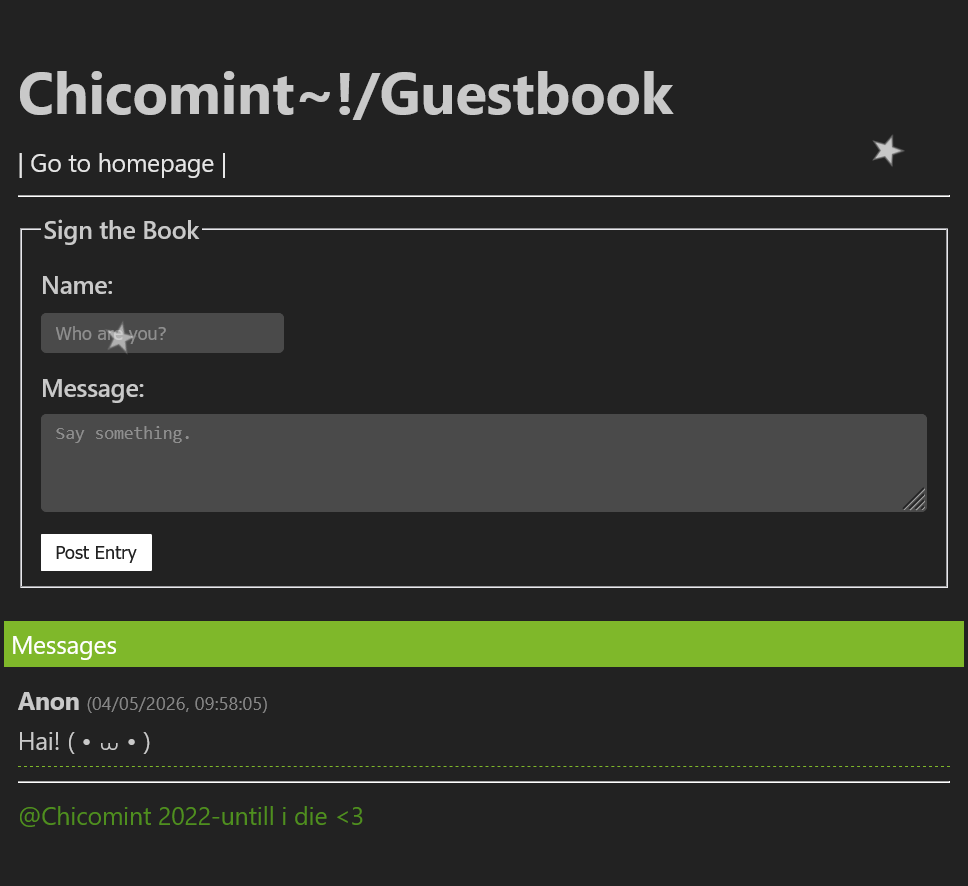
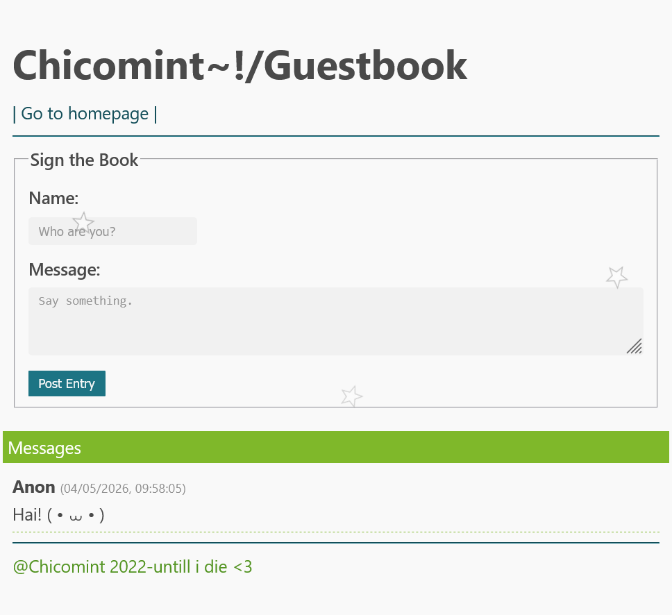

# chiko_guestbook
A Guestbook system using nodejs&amp;Bun for my site!&lt;3

</img>
</img>

<h1>How to use?</h1>

Clone this git and go to the file then run : "bun install" and  "bun add @elysiajs/html"

to deploy that using: "bun src/index.ts"

look at "localhost:8080" 

(≧◡≦) ♡

 

The message will keep to a messages.json file.
